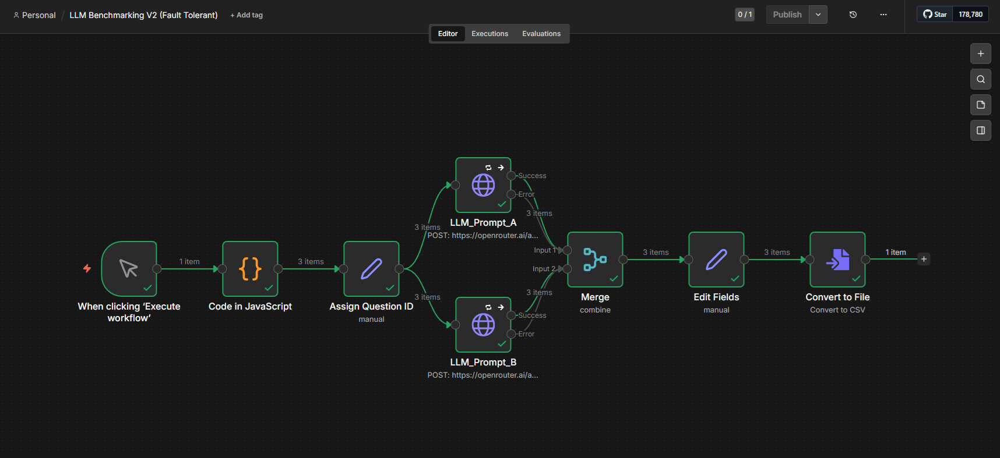
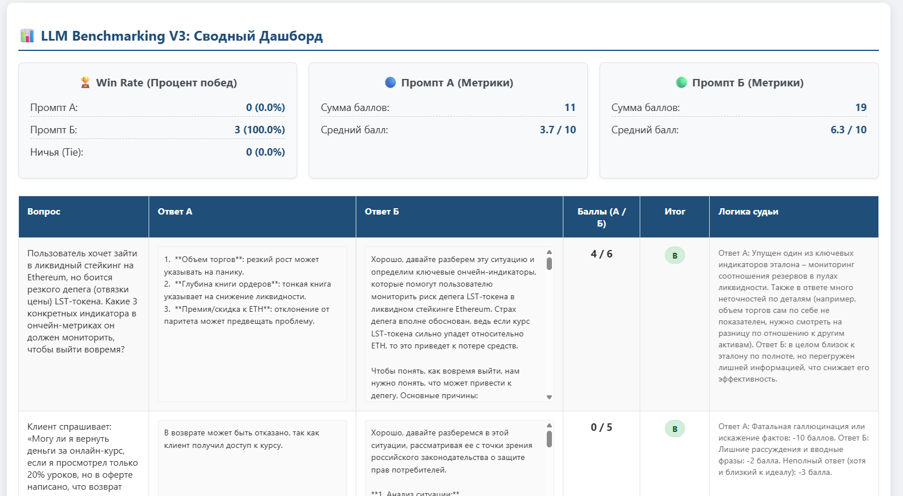

# 🤖 LLM Benchmarking & Evaluation Tool (v2.0)

Профессиональный инструмент для автоматизированного A/B тестирования и глубокой аналитики ответов больших языковых моделей (LLM).

## 🚀 Как это работает

Проект объединяет гибкость low-code автоматизации и мощь Python-аналитики:

1.  **Сбор данных (n8n):** Воркфлоу параллельно опрашивает разные модели, контролирует ошибки API и собирает результаты в единый CSV-датасет.
2.  **Аналитика (Python + Pandas):** Скрипт-судья проводит кросс-валидацию ответов по эталону, начисляет штрафные баллы и генерирует наглядный отчет.

---

## 📐 Визуализация системы

### Воркфлоу сбора данных в n8n:
Спроектирован с учетом отказоустойчивости (Fault Tolerance) и автоматической обработки сбоев.

### Интерактивный Дашборд аналитики:
Визуализация Win Rate, средних баллов и детальной логики судейства по каждому вопросу.

---

## 🛠 Технологический стек

* **Automation:** n8n (Fault Tolerant architecture).
* **Data Science:** Python 3.x, Pandas (Data processing).
* **LLM Integration:** OpenRouter (Gemini, GPT, Claude).
* **Reporting:** HTML5/CSS3 Dashboard & Excel exports.

## 📦 Установка и запуск

1.  Клонируйте репозиторий.
2.  Установите библиотеки: `pip install pandas requests python-dotenv openpyxl`.
3.  Добавьте ваш `OPENROUTER_API_KEY` в файл `.env`.
4.  Запустите воркфлоу в n8n для генерации `file.csv`.
5.  Выполните анализ: `python judge.py`.